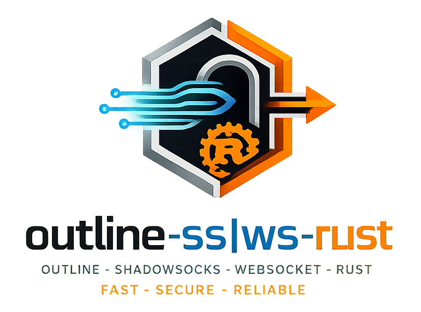

<p align="center">
  
</p>

# outline-proxy

`outline-proxy` — это Cargo workspace (монорепозиторий), в котором живут обе
половины Outline-совместимой прокси-системы на базе Shadowsocks AEAD и VLESS
поверх WebSocket / XHTTP / HTTP/3.

- **[`outline-ss-rust`](bins/outline-ss-rust/)** — **серверный** data plane.
  Принимает Shadowsocks AEAD или VLESS поверх WebSocket (HTTP/1.1, RFC 8441 H2,
  RFC 9220 H3) и XHTTP и релеит на произвольные TCP/UDP назначения.
  Multi-user с per-user политиками, Prometheus-метрики, опциональные встроенные
  TLS- и QUIC/H3-listener'ы.
- **[`outline-ws-rust`](bins/outline-ws-rust/)** — **клиент**. Принимает
  локальный SOCKS5 (и опциональный TUN) трафик и отправляет его через
  соответствующие транспорты, с multi-uplink failover, балансировкой нагрузки
  и health-пробами.

Клиент дайлит сервер; обе стороны говорят на одном wire-протоколе и делят набор
общих крейтов — поэтому они в одном репозитории.

*English version: [README.md](README.md)*

## Поддерживаемые протоколы и транспорты

Две независимые оси: **протокол полезной нагрузки (payload)** — что едет внутри —
и **транспорт-носитель (carrier)** — как он доставляется. Клиент и сервер
согласуют пару из обоих на каждый uplink.

| Payload \ Carrier | WebSocket (h1/h2/h3) | XHTTP (h1/h2/h3) |
|---|:---:|:---:|
| **Shadowsocks** (AEAD / SS2022) | ✅ | ✅ |
| **VLESS** | ✅ | ✅ |

XHTTP — это протокол `packet-up` / `stream-one`. VLESS ходит по нему для
TCP + UDP на одном пути; Shadowsocks — на **forward-пути** (client→server) и для
TCP, и для UDP. По умолчанию TCP и UDP идут по раздельным base-путям (серверные
`xhttp_path_tcp` / `xhttp_path_udp`, зеркаля WS-разделение `ws_path_tcp` /
`ws_path_udp`); опционально их можно свести на **один общий путь** (серверный
`xhttp_path_ss`, клиентский `ss_xhttp_url` + `ss_mode`). Тогда разделение TCP/UDP
несёт скрытый дискриминатор в session id, и цензор видит один endpoint вместо
двух. Тот же combined-вариант работает и для WebSocket (серверный `ws_path_ss`,
клиентский `ss_ws_url`). Все остальные ячейки поддерживаются в обе стороны.

Клиент выбирает пару `transport` + `mode` на каждый uplink:

| `transport` | режим | допустимые значения `*_mode` | поле URL для dial |
|---|---|---|---|
| `ss` (алиас `shadowsocks`; deprecated `ws` / `websocket`) | split | `ws_h1` · `ws_h2` · `ws_h3` · `xhttp_h1` · `xhttp_h2` · `xhttp_h3` | `tcp_ws_url` / `udp_ws_url` (ws) · `tcp_xhttp_url` / `udp_xhttp_url` (xhttp) |
| `ss` | combined | `ws_h1` · `ws_h2` · `ws_h3` · `xhttp_h1` · `xhttp_h2` · `xhttp_h3` | `ss_ws_url` or `ss_xhttp_url` + `ss_mode` |
| `vless` | — | `ws_h1` · `ws_h2` · `ws_h3` · `xhttp_h1` · `xhttp_h2` · `xhttp_h3` | `vless_ws_url` (ws) · `vless_xhttp_url` (xhttp) |

Алиасы носителей: `h1` / `http1` → `ws_h1`, `h2` → `ws_h2`, `h3` → `ws_h3`.

**Носители (carrier)**

- **WebSocket h1 / h2 / h3** — RFC 6455, RFC 8441 (H2 Extended CONNECT), RFC 9220
  (H3 Extended CONNECT). Базовый путь для обоих payload'ов.
- **XHTTP** — два sub-режима: `packet-up` (каждый пакет — отдельный запрос,
  работает на h1 / h2 / h3) и `stream-one` (один bidi-POST, нужен мультиплекс —
  только h2 / h3; на h1 сервер отдаёт 505). Несёт VLESS (TCP + UDP) и
  Shadowsocks (forward-путь TCP + UDP).

**Автоматический fallback** (per-uplink, в том числе mid-session): WebSocket
деградирует `h3 → h2 → h1`, XHTTP — `xhttp_h3 → xhttp_h2 → xhttp_h1`.

> **Совместимость с Outline:** Shadowsocks-over-WebSocket — это путь, на котором
> говорят приложения Outline: сервер выдаёт для него Outline-ключ доступа
> (`$type: websocket`, TCP + UDP). Shadowsocks-over-XHTTP —
> standalone-режим только для встроенного клиента
> `outline-ws-rust`, наружу как Outline-ключ не отдаётся — но для combined-path
> Shadowsocks-юзера сервер также выдаёт share-link `ss://…` (`ws` / `xhttp`,
> SIP002 userinfo) для этого клиента. VLESS отдаётся как share-link
> `vless://…` (`ws` / `xhttp`).

## Структура

```
outline-proxy/
├── bins/
│   ├── outline-ss-rust/   # серверный бинарь  (+ его README, CHANGELOG, docs/)
│   └── outline-ws-rust/   # клиентский бинарь  (+ его README, CHANGELOG, docs/)
├── crates/                # общие крейты (wire-протокол, transport, uplink, tun, crypto, routing, …)
├── vendor/                # пропатченные h3 + sockudo-ws (одна копия, на уровне workspace)
├── .cargo/config.toml     # cross-build алиасы (ss-* / ws-*)
├── .github/workflows/     # CI: per-binary release / nightly / tag пайплайны
├── AGENTS.md              # правила для контрибьюторов + монорепо-инварианты
└── Cargo.toml             # корень workspace: members, профили, [patch.crates-io]
```

Документация по каждому бинарю лежит рядом с ним —
[README сервера](bins/outline-ss-rust/README.md) ·
[README клиента](bins/outline-ws-rust/README.md) — а более детальные материалы
под каждым `bins/*/docs/` (архитектура, session resumption, настройка uplink'ов,
TUN PMTUD).

Сквозные темы под [`docs/`](docs/):
[carrier-padding](docs/PADDING.ru.md) ·
[выбор исходящего IPv6](docs/OUTBOUND-IPV6.ru.md) ·
[mesh-кластер серверов](docs/CLUSTER.ru.md).

## Сборка

Оба бинаря — Rust edition 2024.

```bash
# весь workspace
cargo build --release
cargo test --workspace

# один бинарь
cargo build --release -p outline-ss-rust
cargo build --release -p outline-ws-rust

# musl cross-сборки через алиасы cargo-zigbuild (нужны cargo-zigbuild + zig)
cargo ss-release-musl-x86_64
cargo ws-release-musl-aarch64
```

`rustls` во всём workspace использует провайдер `aws-lc-rs`, а HTTP/3 WebSocket
path зависит от пропатченных `vendor/h3` и `vendor/sockudo-ws`. Полный набор
монорепо-инвариантов — в [`AGENTS.md`](AGENTS.md).

## Релизы

Каждый бинарь версионируется и релизится независимо через префиксные теги:

- `ss-v<x.y.z>` → собирает и публикует **сервер** (workflow *Tag Release (server)*)
- `ws-v<x.y.z>` → собирает и публикует **клиент** (workflow *Tag Release (client)*)

Push'и в `main` публикуют rolling-предрелизы `ss-nightly` / `ws-nightly`
(с path-фильтром — пересобирается только затронутый бинарь). Ручные workflow
*Release (server|client)* поднимают версию в соответствующем `bins/*/Cargo.toml`
и запускают процесс тегирования.

## Лицензия

GPL-3.0 — см. [LICENSE](LICENSE).
